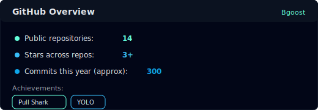

## 🌊 About Me

I build **backend systems** where **logic**, **data flows**, and **structure** matter more than surface polish.

My background is rooted in **C#/.NET development**, **REST APIs**, and **database-driven systems**, combined with hands-on experience in **systems administration**. That mix made me opinionated about **clean code**, **explicit design**, and understanding what’s actually happening under the hood.

I enjoy working on problems where **correctness matters**, **abstractions are earned**, and **complexity is intentional**. When something breaks, I want to know *why* - not just how to patch it.

---

## 📊 Infrastructure & Stats

  <table>
    <tr>
      <td></td>
      <td></td>
    </tr>
  </table>

---

## 🛠 Tech Stack

*C# · .NET · ASP.NET Core · SQL · Entity Framework · REST · Git · Docker · Linux · C · C++ · Bash · Python*

---

## 🏫 42 Common Core Cursus
> **Deep dive into systems programming and low-level logic — under the surface.**

<b>📂 Click to expand my 42 Projects Journey</b>

 

<table>
  <thead> 
    <tr>
      <th align="center">Level</th>
      <th align="center">Tech</th>
      <th align="left">Project</th>
      <th align="left">Key Concept</th>
    </tr>
  </thead>
  <tbody>
    <tr>
      <td align="center">🟢 0-1</td>
      <td align="center">C, Vim, Linux</td>
      <td><b><a href="https://github.com/Bgoost/libft">libft</a> / born2beRoot</b></td>
      <td><b>Standard library</b> recreation & <b>SysAdmin</b> basics (SSH, sudo, firewall).</td>
    </tr>
    <tr>
      <td align="center">🟢 1</td>
      <td align="center">C</td>
      <td><b><a href="https://github.com/Bgoost/ft_printf">ft_printf</a> / <a href="https://github.com/Bgoost/get_next_line">get_next_line</a></b></td>
      <td><b>Variadic functions</b> & <b>file descriptor</b> management.</td>
    </tr>
    <tr>
      <td align="center">🟢 2-3</td>
      <td align="center">C, Unix</td>
      <td><b>
        <a href="https://github.com/Bgoost/push_swap">push_swap</a> /
        <a href="https://github.com/Bgoost/so_long">so_long</a> /
        <a href="https://github.com/Bgoost/minitalk">minitalk</a>
      </b></td>
      <td><b>Sorting algorithms</b>, <b>2D rendering</b> (minilibx) & <b>signals / IPC</b>.</td>
    </tr>
    <tr>
      <td align="center">🟢 3</td>
      <td align="center">C, Threads</td>
      <td><b><a href="https://github.com/Bgoost/philos">philosophers</a> / <a href="https://github.com/Bgoost/minishell">minishell</a></b></td>
      <td><b>Concurrency</b> (mutexes) & building a <b>Unix shell</b> (pipes, redirections, built‑ins).</td>
    </tr>
    <tr>
      <td align="center">🟢 4</td>
      <td align="center">Network, C++</td>
      <td><b>netpractice / <a href="https://github.com/Bgoost/Cub3D">cub3D</a> / <a href="https://github.com/Bgoost/CPPS">C++ modules 00-04</a></b></td>
      <td><b>Subnetting</b>, <b>3D raycasting</b> and first steps in <b>OOP C++</b>.</td>
    </tr>
    <tr>
      <td align="center">🟢 5</td>
      <td align="center">Docker, C++</td>
      <td><b><a href="https://github.com/Bgoost/ft_irc">ft_irc</a> / <a href="https://github.com/Bgoost/inception">inception</a> / <a href="https://github.com/Bgoost/CPPS">C++ modules 05-09</a></b></td>
      <td><b>IRC server</b> (RFC 1459), <b>containerized infra</b> and advanced <b>C++</b> (templates, containers).</td>
    </tr>
    <tr>
      <td align="center">🟡 6</td>
      <td align="center">JS, React, Postgres</td>
      <td><b><a href="https://github.com/Bgoost/transcendence">transcendence</a></b></td>
      <td><b>Full‑stack</b> project with <b>real‑time</b> architecture.</td>
    </tr>
  </tbody>
</table>

---

## 🐍 Activity Flow

---

  

> *“Always code as if the person who ends up maintaining your code is a violent psychopath who knows where you live.”*  
> -**John Woods**